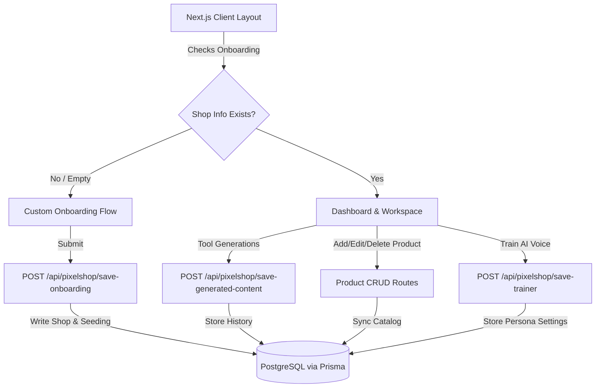

# PixelShop Full-Stack Integration Walkthrough
This document outlines the architecture, database models, and user onboarding customization implemented to establish PixelShop as a state-of-the-art full-stack platform.

---

## 🎨 Architecture & Data Flow

---

## 🚀 Key Achievements

### 1. PostgreSQL & Prisma ORM Foundation
* **Shared Prisma Client:** Setup a global shared `PrismaClient` in `src/lib/prisma.ts` with auto-logs for error/warning management, ensuring optimal connection pooling.
* **Unified Database Controller:** Built a clean routing architecture inside `app/api/pixelshop/[action]/route.ts` that intercepts and handles database operations.
* **Full Product CRUD Sync:** Updated `AppContext` mutations (`addProduct`, `editProduct`, `deleteProduct`) to sync instantly with PostgreSQL using HTTP requests.

### 2. Personalized Onboarding & Seeding
* **Tailored Custom Setup:** Added support for both default recommended choices and custom user inputs (e.g. custom category and custom brand voice) during the 3-step setup onboarding process.
* **Intelligent Product Seeding:** Created a dynamic `getDummyProducts(category)` engine that automatically seeds the user's PostgreSQL database with tailored dummy products based on the exact category selected during setup.
* **Automatic Workspace Lock:** Configured `MainLayout` to detect unconfigured shops and automatically guide the user to the onboarding wizard, locking access to the workspace until setup completes.

### 3. Persistent AI Voice Training
* **AI Trainer Database Mapping:** Fully connected the AI Brand Voice Settings screen to the PostgreSQL `AiSettings` table, saving user parameters (formality level, favorite/avoid words, and character) securely.
* **Auto-population on Load:** Configured `AITrainerView` to automatically load previously trained parameters, ensuring that the assistant retains its unique voice across sessions.

---

## 🛠️ Next Steps: Applying Database Migrations

To activate this full-stack integration locally, the packages must be installed and the database schema must be pushed. 

> [!WARNING]
> Please approve the proposed commands to install packages and initialize database migrations so that the Next.js compilation can run smoothly.
